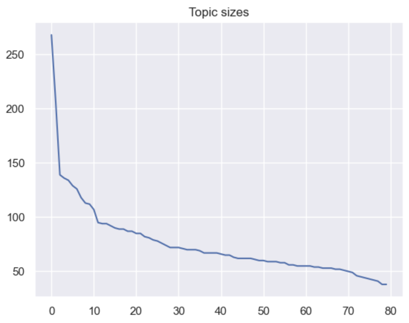
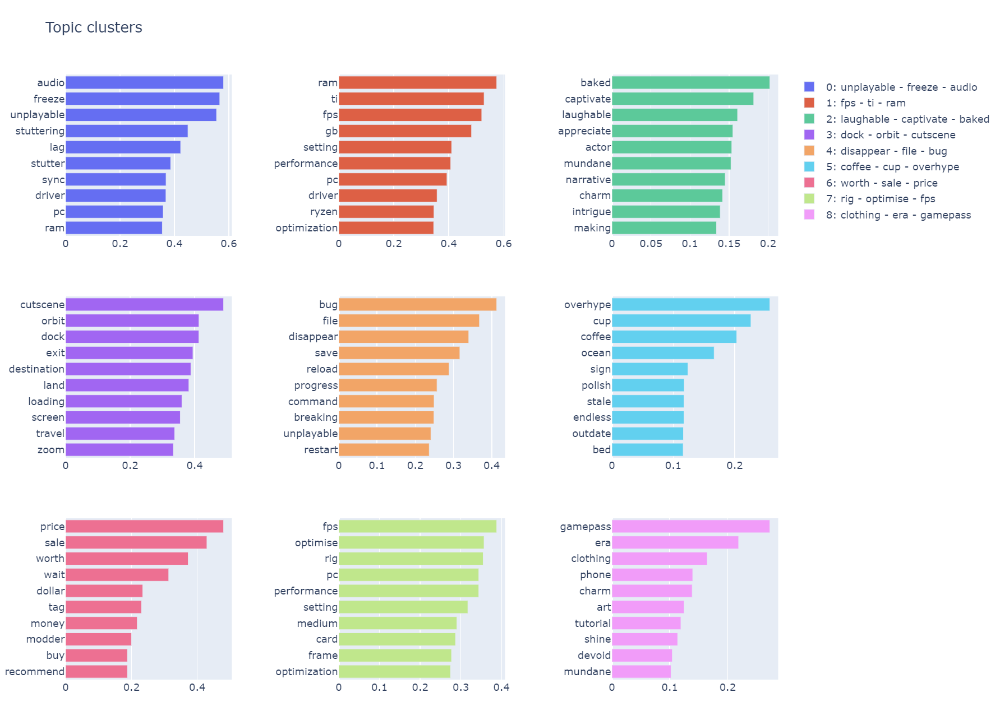
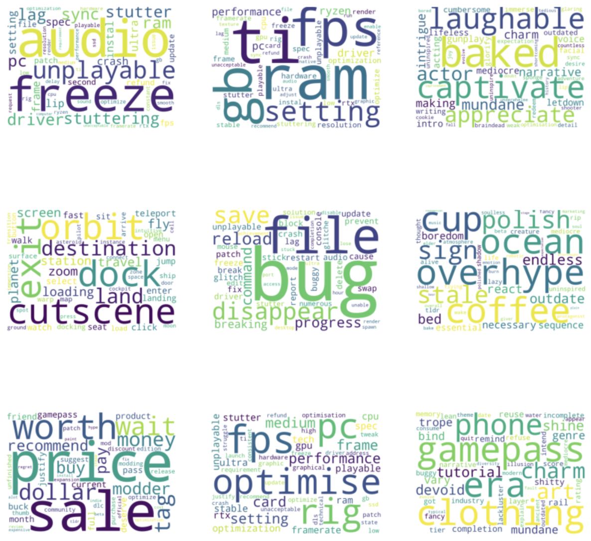

# What's wrong with Starfield?
Starfield is a AAA video game released by industry giant Bethesda, known for such classics as The Elder Scrolls and Fallout (3 and ongoing), in the summer of 2023. Bethesda games tend to be divisive, so while it garnered lots of praise, there are also plenty of people who dislike the game or parts of it. Many of those voice their frustrations in Steam reviews, and thus we have a fantastic opportunity to use that data and do a little analysis.

# Problem statement and application
- Drill into negative Steam reviews for Starfield and generate semantic topic clusters
- Understand the key areas of concerns players have with the game
- This could be used in a hypothetical scenario to better understand player sentiment when planning future patches, DLCs or a sequel, or for community management without the need to peruse tens of thousands of individual reviews

# Background
NLP (Natural Language Processing) is fascinating because it allows us to take completely unstructured, non-numerical data and lets us make sense of it anyway using advanced ML models. This is especially exciting because in many data science projects, getting your data into a shape that a machine can understand is a big part of the puzzle.

# Choosing the model: Top2Vec
For this problem, I chose the model Top2Vec. Top2Vec has been shown to be more effective than other techniques such as Latent Dirichlet allocation, which I also experimented with in an earlier phase of this project, when using and analyzing Twitter posts. I figured Steam reviews to be close to Twitter posts in length and writing style. Given that our aim is to create meaningful, interpretable topic clusters (because we want to communicate the results to our business owners), Top2Vec seems like a great starting point. Plus, it's really easy to use and understand, which is always a plus.

# Getting to the reviews
Thankfully, there's an API we can call easily. Documentation is straight-forward and allows us to write two short functions that retrieves as many reviews as we want. Even better, we can choose to fetch only negative or positive reviews, which saves us a whole sentiment analysis step.
Documentation: https://partner.steamgames.com/doc/store/getreviews

# Data cleaning
Little data cleaning was necessary, but of course we want to prepare the text for our model. That includes:
- Lemmatization
- Removing stopwords, punctuation
- Removing unusable information such as URLs

# Training the model
With our cleaned data, we're ready to train the model. Throughout testing, for this particular dataset, the best hyperparameters turned out to be:
- min_words: 30 (Given that our corpus isn't enormous)
- speed: deep-learn (as we're training for best results)
- embedding_model: doc2vec (Given that our reviews aren't very long and similar to Twitter data)

# Results
We ended up with a decent number of clusters with interpretable word combinations. 

Using plotly, we visualized the data of the first nine clusters. 

And the same data as wordclouds.

We can clearly identify some recurring topics, which may prompt us to further finetune our model.

So far, some of the main issues people seem to have are:
1. **Freezes, glitches and bugs** with corrupted save files (0, 4)
2. **Performance issues** and hardware hunger (1, 7)
3. A **mundane narrative** and uninteresting main story (2)
4. Too many immersion-breaking **cutscenes** and **loading screens** (3)
5. **Value for money** - they feel the game was overhyped and underdelivered (5, 6)

Finally, I want to add that the game has received hundreds of thousands of positive reviews as well. We're focusing on the negative here to simulate a business case where we are helping the development team understand what **isn't** working.

# Sources
- Top2Vec documentation: https://top2vec.readthedocs.io/en/stable/Top2Vec.html
- Steam Reviews: https://partner.steamgames.com/doc/store/getreviews
